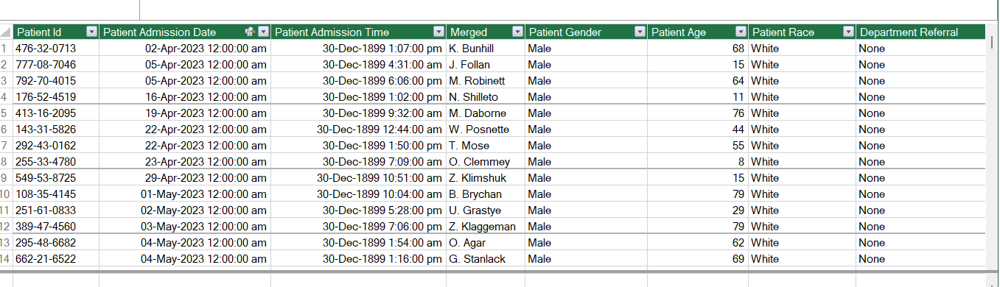

# Hospital Emergency Room Dashboard — Excel

An interactive **healthcare analytics dashboard** developed in Microsoft Excel to analyze emergency room operations, patient demographics, waiting times, admissions, satisfaction, and department referrals.

This project demonstrates practical skills in **data analysis, data visualization, KPI reporting, and business intelligence using Microsoft Excel**.

---

## Project Overview

Healthcare organizations need clear and accessible reporting to monitor operational performance and identify trends in patient activity.

This project transforms raw emergency room data into an interactive Excel dashboard that provides a consolidated view of key operational and patient-related metrics.

The dashboard enables users to explore emergency room performance by **month and year** while monitoring important KPIs and analytical dimensions.

---

## Dashboard Preview

.png)

---

## Dataset Preview



---

## Business Questions

The dashboard is designed to help answer questions such as:

* What is the total number of emergency room patients?
* What is the average patient waiting time?
* What percentage of patients were attended within 30 minutes?
* How many patients were admitted?
* What is the average patient satisfaction score?
* Which age groups account for the highest patient volume?
* What is the gender distribution of patients?
* Which departments receive the highest number of referrals?
* How does patient activity change over time?

---

## Key Performance Indicators

### Total Patients

The total number of emergency room patients represented in the dataset.

### Average Wait Time

The average amount of time patients waited before being attended by medical staff.

### Patient Satisfaction

The average satisfaction score recorded for emergency room patients.

### Admission Status

A breakdown of patients based on whether they were admitted or not admitted.

---

## Dashboard Features

* Interactive month slicer
* Year filtering
* Dynamic KPI reporting
* Pivot Tables
* Pivot Charts
* Sparklines
* Conditional Formatting
* Interactive visual analysis
* Healthcare-focused reporting

---

## Analytical Components

### Patient Admission Analysis

Compares admitted and non-admitted patients to provide visibility into admission patterns.

### Patient Age Analysis

Segments patients into age groups to identify demographic patterns within emergency room activity.

### Timeliness Analysis

Measures the proportion of patients attended within the **30-minute target**.

### Gender Analysis

Provides a breakdown of emergency room patients by gender.

### Department Referral Analysis

Analyzes referrals to departments including:

* General Practice
* Orthopedics
* Cardiology
* Neurology
* Gastroenterology
* Physiotherapy
* Renal

### Time-Based Analysis

Monthly and yearly filtering enables users to analyze changes in emergency room activity over time.

---

## Tools & Techniques

**Microsoft Excel**

* Pivot Tables
* Pivot Charts
* Slicers
* Sparklines
* Excel Formulas
* Conditional Formatting
* Data Cleaning
* Data Visualization
* KPI Reporting

---

## Skills Demonstrated

This project demonstrates practical experience with:

* Data Cleaning
* Data Analysis
* Exploratory Data Analysis
* Data Visualization
* Dashboard Development
* Business Intelligence
* KPI Design
* Interactive Reporting
* Healthcare Analytics
* Microsoft Excel

---

## Project Workflow

```text
Raw Dataset
     ↓
Data Cleaning & Preparation
     ↓
Data Analysis
     ↓
Pivot Tables & Calculations
     ↓
KPI Development
     ↓
Data Visualization
     ↓
Interactive Dashboard
```

---

## Project Structure

```text
Hospital-Emergency-Room-Dashboard-Excel/
│
├── Dashboard.xlsx
├── Dashboard.png
├── Raw_Data.png
└── README.md
```

---

## Future Enhancements

Potential extensions of this project include:

* Power BI implementation
* SQL database integration
* Power Query automation
* Automated data refresh
* Advanced healthcare KPIs
* Time-series forecasting
* Advanced healthcare analytics

---

## Portfolio Context

This project is part of my **Data Analytics and Business Intelligence portfolio** and demonstrates how spreadsheet-based analytical techniques can be used to transform raw operational data into an interactive reporting solution.

I am particularly interested in applying these analytical foundations to **Python, Data Science, Machine Learning, and AI-driven analytics applications**.

---

## About Me

**Muhammad Faisal Jahangeer**

**Python Developer | Data Analyst | Data Science & AI/ML Enthusiast**

I build practical data and software projects focused on transforming data into useful insights, analytical solutions, and applications.

My areas of interest include:

* Python Development
* Data Analytics
* Data Science
* Machine Learning
* Artificial Intelligence
* Business Intelligence
* Data Visualization

---

## Connect

[](https://www.linkedin.com/in/muhammad-faisal-jahangeer-4b38393a8/)

---

## ⭐ Feedback

If you find this project useful, feel free to explore the repository, review the dashboard, and share your feedback.

---

<p align="center">

**Data → Analysis → Visualization → Decision**

</p>
